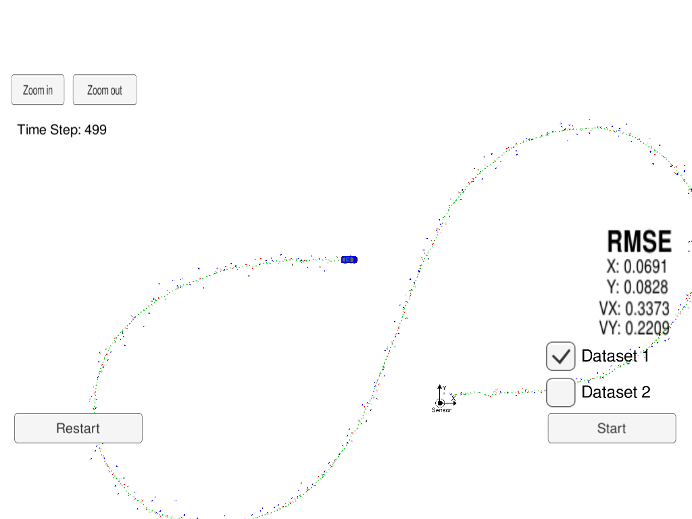
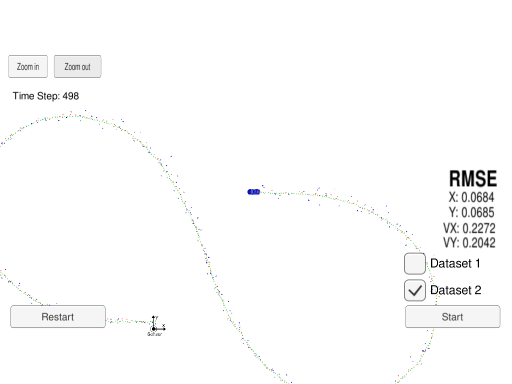

# Unscented Kalman Filter

## About Kalman Filter

Kalman Filter (KF) is an algorithm to produce estimation of unknown variables using the system's dynamical model and multiple sequential measurements.

KF can be devided in two steps:
* Prediction for the new state for the unknown variable (e.g: position and velocity) and the error covariance matrix.
* Update of the state and error covariance matrix.

In this project, we are taking multiple readings from (simulated) laser and radar, and combine these measurements to produce state, which is more accurate than the laser and radar measurements.

Since we are dealing with non-linearities, we need to apply some type of linearization in the KF; in this case we add sample points from the system to do a transformation where the moments of state variable remain approximately constant. This Kalman Filter is call Unscented (UKF).

This approximation can create good estimates if the assumptions of the model are really maintained in the real world system. In this project we have simulated data that follows a constant turn rate and velocity magnitude (CTRV), so we can expect that using this assumptions in our model will allow the UKF to provide good estimations.

## Compiling and executing the project

- Clone the repo and cd to it on a Terminal.
- Create the build directory: `mkdir build`.
- `cd build`
- `cmake ..`
- `make`: This will create the executable `UnscentedKF`, that contains UKF implementation.

`UnscentedKF` communicates with a Udacity simulator that reads the input data and produces estimations for the object. See [Udacity's seed project](https://github.com/udacity/CarND-Extended-Kalman-Filter-Project) for more information on how to install the simulator.

Open the simulator and run `./UnscentedKF` to enable the connection. Select Projects 1/2 from the simulator.

## Results

Comparing the results between the ExtendedKF and the UnscentedKF we can see that the main improvement resides on the estimation of the velocities. This is expected, since in the ExtendedKF we were assuming constant velocity, while in the UnscentedKF we assume constant turn rate and velocity magnitude. Since the data follows constant turn rate (but not constant velocity!).

UnscentedKF combines the readings from Radar and Lidar information and estimates the current position of the object with small RMSE. The RMSE (x position, y position, x valocity, y velocity) for the two datasets I tried are:

- Dataset 1: 0.0691, 0.0828, 0.3373, 0.2209
- Dataset 2: 0.0684, 0.0685, 0.2272, 0.2042

Compared with the ExtendedKF result:

- Dataset 1: 0.097, 0.085, 0.451, 0.439
- Dataset 2: 0.072, 0.096, 0.421, 0.492

The correct modeling seems to have helped minimizing the error, but we would need to compare both methods using the same model to check if Extended or Unscented produce similar results.

## Code structure

The code is structured in 1 main class:

- UKF: contains the main logic that receives and processes measurements. For each measurement received two steps are performed: prediction and update. 

I tried to add smaller, more descriptive methods to simplify reading the code. To read the code we can start with ProcessMeasurement, that describes the global structure. Then, the methods `Initialize`, `Predict` and `Update` contain the main core of the Unscented Kalman filter.

`Initialize` deals with the initialization of the internal state and covariance matrix.

`Predict` computes the sigma points and predicts both the state and the covariance.

`Update` takes into account the source of the date, transforms the sigma points into the space of the data we are receiving and updates the state and covariance for the current iteration, using the differences between previous predictions and the measurement.

## Notes & next steps

I ran some other tests with the data provided, comparing the RMSE between using data from both Lidar and Radar, or only using one of the two sources. The results using Lidar data seem to be more precise for position, and there was almost no difference between using Lidar and Radar for the estimated valocities (at least not with the datasets I used). The improvement on the RMSE with respect to the Extended Kalman Filter project are expected given that the model used represents better the reality (CTRV vs CV).

Next steps for this project:

- Get other sensor data and use the Kalman filter to estimate state of an object.
